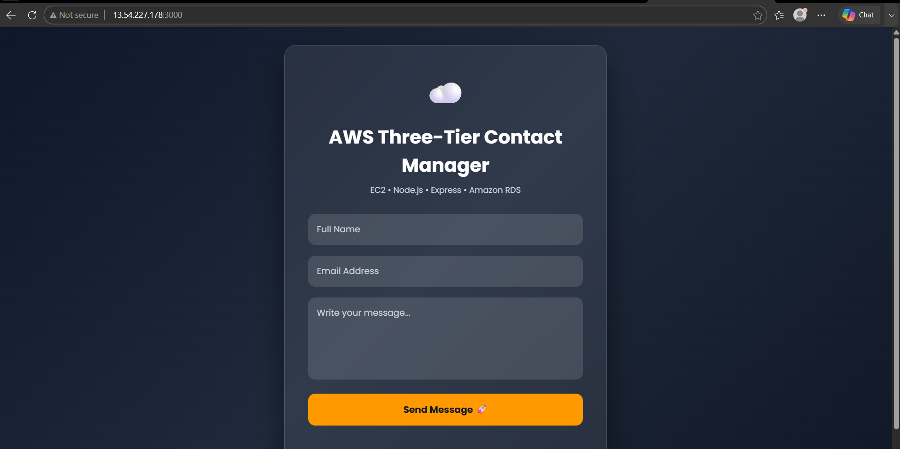
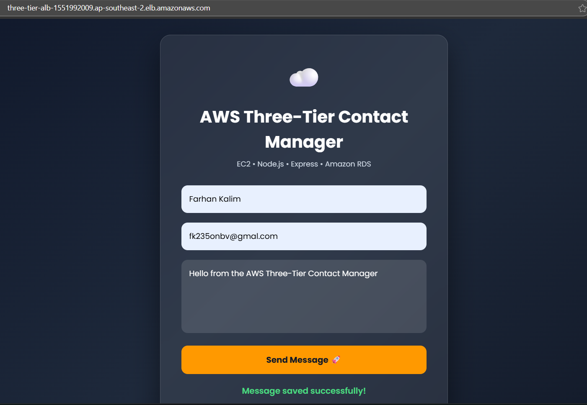
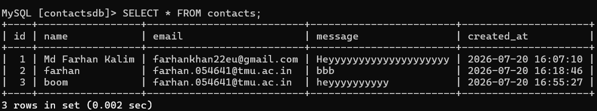
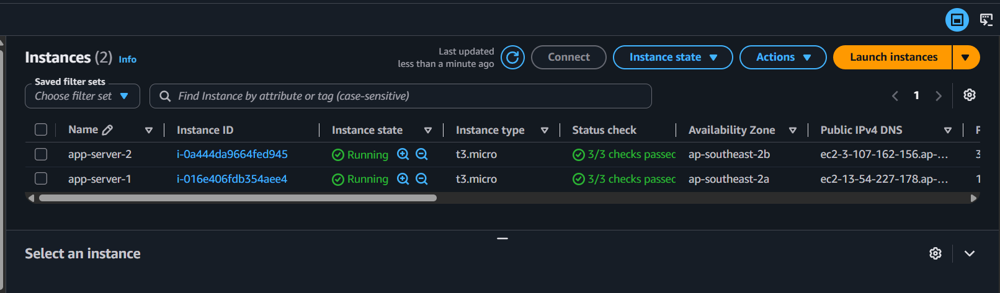
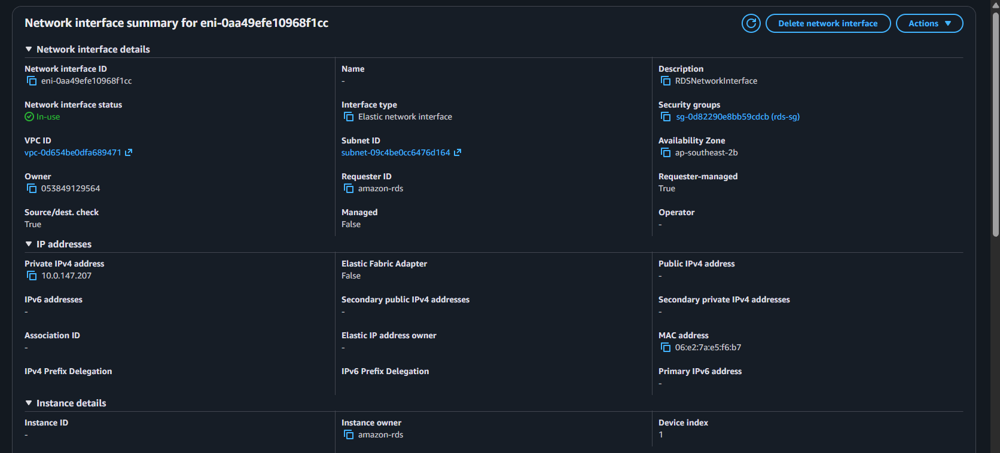
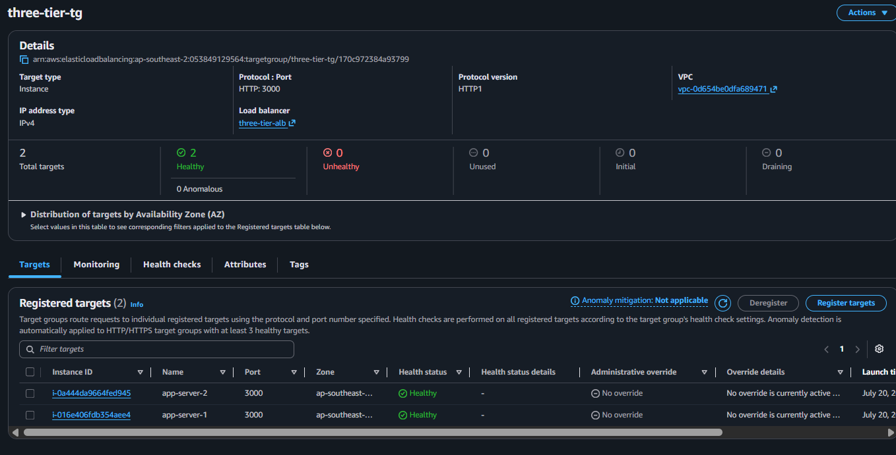
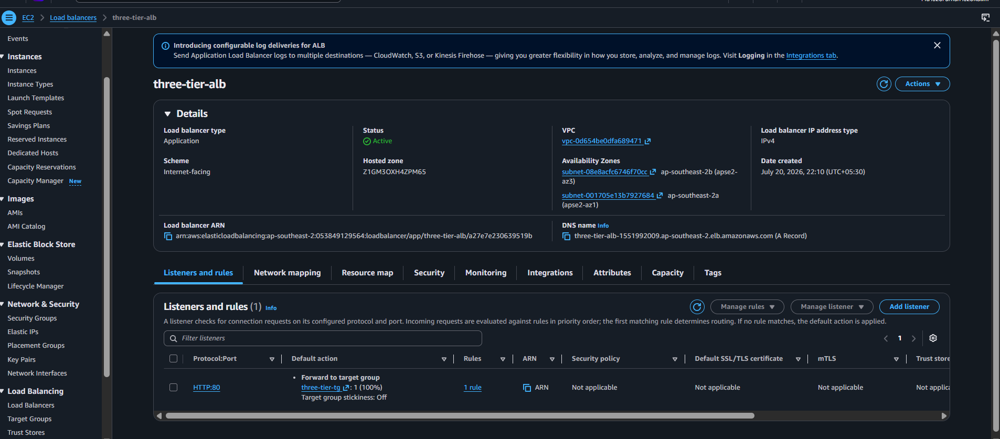
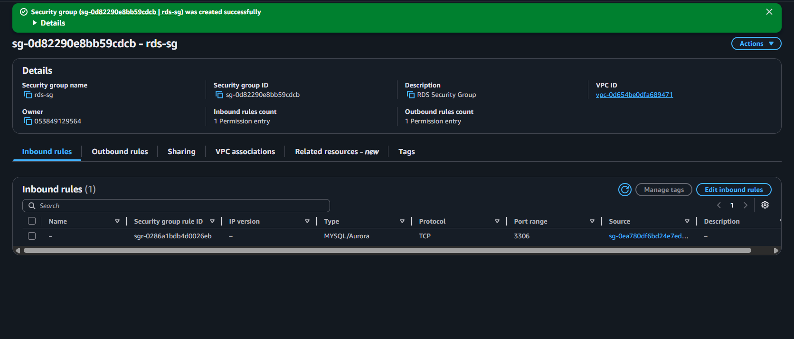
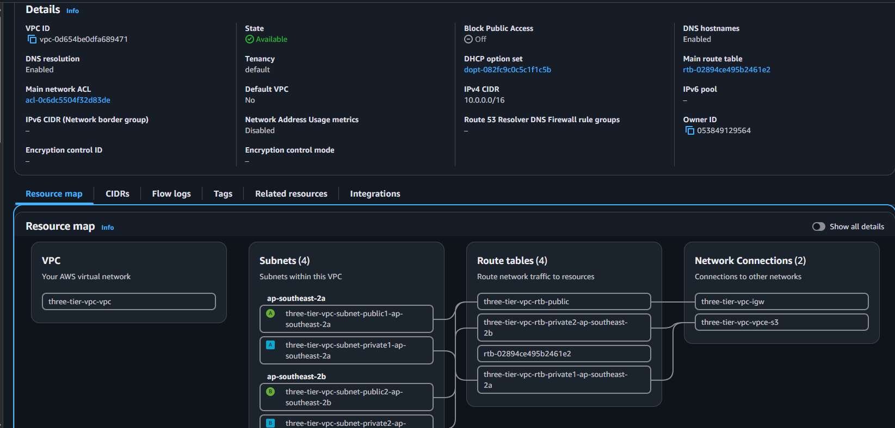
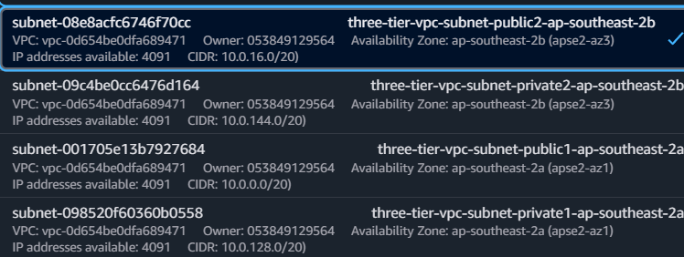

# AWS Three-Tier Web Application

A contact-manager web app deployed on a classic **three-tier architecture** in AWS — a Node.js/Express backend running on EC2 behind an Application Load Balancer, with data persisted in an Amazon RDS MySQL database, all inside a custom VPC with public and private subnets.


-4479A1?logo=mysql&logoColor=white)


---

## 📐 Architecture

```
                 ┌────────────────────┐
  Internet ───▶  │  Application Load  │
                 │     Balancer       │
                 └─────────┬──────────┘
                           │
              Public Subnets (2 AZs)
                           │
        ┌──────────────────┴──────────────────┐
        ▼                                      ▼
 ┌──────────────┐                     ┌──────────────┐
 │  EC2 Instance │                     │  EC2 Instance │
 │ (Node/Express)│                     │ (Node/Express)│
 └──────┬────────┘                     └──────┬────────┘
        │                                     │
        └──────────────────┬──────────────────┘
                            ▼
                 Private Subnets (2 AZs)
                            │
                   ┌────────▼─────────┐
                   │   Amazon RDS      │
                   │   (MySQL)         │
                   └───────────────────┘
```

**Tier breakdown:**

| Tier | Component | Purpose |
|------|-----------|---------|
| **Presentation** | Static HTML/CSS/JS served by Express (`public/`) | Contact form UI |
| **Application** | Node.js + Express on EC2 (behind ALB, across 2 AZs) | Handles form submissions, business logic |
| **Data** | Amazon RDS (MySQL) in private subnets | Stores contact submissions |

---

## ✨ Features

- Simple, responsive contact form (name, email, message)
- REST API endpoint that validates and stores submissions
- Auto-creates the `contacts` table on first run if it doesn't exist
- Highly available web tier — two EC2 instances behind an ALB target group
- Data tier isolated in private subnets, unreachable from the public internet
- Security groups scoping traffic between each tier (ALB → EC2 → RDS only)

---

## 🛠️ Tech Stack

- **Backend:** Node.js, Express 5
- **Database:** MySQL (via `mysql2` driver), hosted on Amazon RDS
- **Frontend:** Vanilla HTML/CSS/JavaScript
- **Infrastructure:** AWS VPC, EC2, Application Load Balancer, Target Groups, RDS, Security Groups

---

## ☁️ AWS Services Used

- **VPC** — custom network with public and private subnets across multiple AZs
- **EC2 (×2)** — hosts the Node.js application, one per AZ
- **Application Load Balancer** — distributes traffic across EC2 instances
- **Target Group** — health-checks and routes to healthy EC2 instances
- **Amazon RDS (MySQL)** — managed relational database in a private subnet
- **Security Groups** — restrict traffic: ALB ⇄ EC2 ⇄ RDS only

---

## 📁 Project Structure

```
aws-three-tier-web-app/
├── config/
│   └── db.js                # MySQL/RDS connection setup
├── public/
│   ├── index.html            # Contact form UI
│   ├── style.css
│   └── script.js             # Form submit handler (calls /api/contact)
├── routes/
│   └── contactRoutes.js      # POST /api/contact — validates & saves to RDS
├── screenshots/              # Architecture & console screenshots
├── server.js                 # Express app entry point
├── package.json
└── README.md
```

---

## 🚀 Getting Started

### Prerequisites

- Node.js 18+ and npm
- An accessible MySQL database (Amazon RDS or local MySQL for testing)

### Installation

```bash
git clone <your-repo-url>
cd aws-three-tier-web-app
npm install
```

### Configuration

This project uses environment variables to keep database credentials out of the codebase.

1. Install `dotenv`:
```bash
   npm install dotenv
```
2. Create a `.env` file in the project root (already ignored by `.gitignore`):
```env
   DB_HOST=your-rds-endpoint.rds.amazonaws.com
   DB_USER=admin
   DB_PASSWORD=your-secure-password
   DB_NAME=contactsdb
```
3. `config/db.js` reads these values via `process.env` — no credentials are hardcoded in the source.

### Running Locally

```bash
npm start
```

The app runs on **http://localhost:3000**. On startup it connects to the configured database and creates the `contacts` table if it doesn't already exist.

---

## 🔌 API Reference

### `POST /api/contact`

Saves a new contact form submission.

**Request body:**
```json
{
  "name": "Farhan Kalim,
  "email": "farhankhan22eu@gmail.com",
  "message": "Hello, I'd like to get in touch."
}
```

**Success response:**
```json
{
  "success": true,
  "message": "Message saved successfully!"
}
```

**Error response:**
```json
{
  "success": false,
  "message": "Database Error"
}
```

---

## 🗄️ Database Schema

```sql
CREATE TABLE IF NOT EXISTS contacts (
    id INT AUTO_INCREMENT PRIMARY KEY,
    name VARCHAR(100) NOT NULL,
    email VARCHAR(100) NOT NULL,
    message TEXT NOT NULL,
    created_at TIMESTAMP DEFAULT CURRENT_TIMESTAMP
);
```

---

## 🖼️ Screenshots

| | |
|---|---|
| **Home Page** | **Contact Form Success** |
|  |  |
| **RDS Data** | **EC2 Instances** |
|  |  |
| **RDS Console** | **Target Group** |
|  |  |
| **Load Balancer** | **Security Groups** |
|  |  |
| **VPC** | **Subnets** |
|  |  |

---

## 🔒 Security Notes

- Database credentials should **never** be hardcoded — use environment variables (`.env`, excluded via `.gitignore`) or AWS Secrets Manager / SSM Parameter Store.
- RDS should sit in **private subnets only**, with a security group that permits inbound traffic solely from the EC2 security group on port 3306.
- EC2 security group should permit inbound HTTP/HTTPS only from the ALB security group, not `0.0.0.0/0`.
- Consider adding input validation/sanitization on the `/api/contact` route to guard against malformed or malicious submissions.

---

## 📄 License

This project is available for personal and educational use. Add a license file (e.g., MIT) if you plan to distribute or open-source it.
